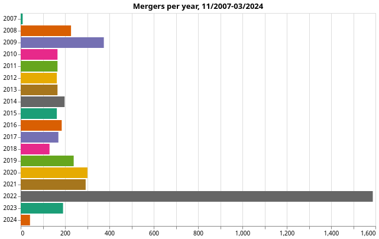

# Charity Commission register analysis

## Roadmap

This repo aims to be an exhaustive analysis of the data released by the Charity Commission at <https://register-of-charities.charitycommission.gov.uk/register/full-register-download>.

Some of the questions we want to look at:

- [x] most frequent transferors
- [x] most frequent transferees
- [x] evolution of number of mergers per year
- [ ] the average time gap between each merger for repeat transferors/transferees?
- [ ] what are the annual returns of the transferee before/after the merger?
- [ ] what's the size of transferors/transferees in terms of annual return?
- [ ] what is the median number of trustees per charity?
- [ ] who are "repeat trustees"?

For starters, the analysis covers the [Register of merged charities](https://www.gov.uk/government/publications/register-of-merged-charities) data.

See the [notebook](https://github.com/harabat/charity_commission_register/blob/main/code/charity_commission.ipynb) for the charts.

## Register of merged charities

### Intro

The data can be found at <https://www.gov.uk/government/publications/register-of-merged-charities>.

Caveats:

- The merger registration data is not accurate, especially the timespans between the dates of transfer and registration can go from -1y to 32y, but varies wildly even when outliers are removed. Ideally, this will be raised with the Charity Commission.
- [Merging two or more Charitable Incorporated Organisations (CIOs)](https://www.gov.uk/government/publications/register-of-merged-charities/guidance-about-the-register-of-merged-charities#merging-two-or-more-charitable-incorporated-organisations-cios) does not require the merger to be registered. Consequently, the register of merged charities will be missing this data. Does this data need to be FOIA'd?

### Most frequent transferors

#### Most transferors are unregistered, exempt, or excepted.

The [Guidance about the register of merged charities](https://www.gov.uk/government/publications/register-of-merged-charities/guidance-about-the-register-of-merged-charities#different-types-of-merger) states:

``` quote
There are different types of merger:
- merging with an existing charity
- merging with a new charity you have set up for the purpose of merging
- changing structure - usually a trust or unincorporated association that wants to change to a CIO or charitable company.
```

The prevalence of unregistered/exempt/excepted transferors probably indicates one of two things:

- Mergers of ****very small charities (which are unregistered/exempt) officially joining bigger ones****. It's likely that these small charities are merging with larger ones to gain economies of scale, access to more resources, or to increase their impact. Alternatively, they might be facing hurdles due to funding constraints, regulatory burdens, or other challenges, and merging with a larger charity is a way to ensure their assets and mission continue.
- Mergers of charities into ****a new structure (CIO or charitable company)****.

#### Most registered transferors have only been in the position of transferring charity once or twice.

This makes sense, since the transferor charity typically ceases to exist as a separate entity after the merger.

The outcomes of a merger, as stated by the [Guidance about the register of merged charities](https://www.gov.uk/government/publications/register-of-merged-charities/guidance-about-the-register-of-merged-charities#why-register):

> - your charity has closed or will close as a result of transferring your assets or
> - your charity has not closed only because it has permanent endowment which will not be transferred to the charity you are merging with

These repeat transferors might be falling into this second case.

#### *The County Durham and Darlington NHS Foundation Trust Charity* seems to be a case of a large consolidation.

A number of department-specific NHS charities have merged into one entity. The aim could be to consolidate funds/reduce administrative overhead/streamline operations.

#### *The Parochial Church Council of the Ecclesiastical Parish of The A453 Churches of South Nottinghamshire* seems to be an example of a "merged" charity splitting into separate entities.

It is the most frequent transferor among registered charities, having been in that position 5 times.

While this seems to be a reverse merger, it could also be the parent charity distributing some assets to children charities.

### Most frequent transferees

Without counting the outlier that merged 1200+ times, some transferees have gone through mergers \>40 times.

Most transferees only go through a merger \<5 times.

Summary from a [Brave](https://search.brave.com/search?q=The+Kingdom+Hall+Trust+&summary=1) search:

The Kingdom Hall Trust:

- Previously known as the London Company of Kingdom Witnesses, it was established on 28th July 1939 and changed its name to The Kingdom Hall Trust on 20th June 1994.
- It is a charity associated with Jehovah's Witnesses, with the charity number GB-CHC-275946.
- The charity has undergone a significant merger in 2022, incorporating 1,279 Jehovah's Witness congregations into the national charity. This is considered one of the largest charity mergers ever.

Other big transferees are Victim Support and The Mission to Seafarers.

### Merger counts



That spike in 2022? It's the merger of 1279 Jehovah's Witnesses churches into The Kingdom Hall Trust.
