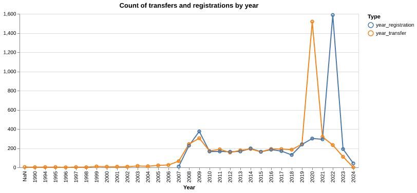

# Register of merged charities

## Observations on data quality

The analysis uncovered some issues in data quality and completeness.

Ideally, this will be raised with the Charity Commission.

### Missing data

[Merging two or more Charitable Incorporated Organisations (CIOs)](https://www.gov.uk/government/publications/register-of-merged-charities/guidance-about-the-register-of-merged-charities#merging-two-or-more-charitable-incorporated-organisations-cios) **does not require the merger to be registered**. Consequently, the register of merged charities will be missing this data: this data might need to be FOIA'd to be accessed.

### Unexpected patterns in dates

The *Register of merged charities* contains **mergers from 1990**, while the **registrations start in late 2007**. Either the register retroactively included a subset of mergers dating from 1990, or the data was entered erroneously.

The **timespans between the dates of transfer and of registration can go from -1y to 32y**, but vary wildly even when outliers are removed. Most mergers are registered a few years after the event, which fits one's understanding of how such processes work: pre-registered mergers or ones registered decades later seem improbable. The repetitive seesaw pattern also seems to indicate errors, though it's not obvious what it's due to.

These very few ancient transfers and their late registrations are probably errors, so we'll choose to drop any transfers from <2008 in our analysis, as they are few and represent the bulk of the long `registered-transfer` durations.

### Different spellings for charity names

In a few hundred records, the name of the same charity can be spelled in slightly different ways: for example, *Harrogate & Area Council for Voluntary Service Ltd* and *Harrogate and Area Council for voluntary Services Limited*.

### No standard way of indicating charity numbers

Charity numbers are generally indicated in the data files as a series of digits between parentheses at the end of the charity name: for example, `Crisis UK (1082947)`.

The charity numbers are sometimes not between parentheses, or contain varying separator characters (1170369-1 vs 1053467.01), or the parentheses contain additional information (status or name).

Often, the charity is exempt from having a registration number, and the reason is often indicated, but it is not provided systematically, and the wording varies greatly.

That **the charity numbers or their absence are not indicated in a standardised way** translates to a **need to identify and evaluate the discrepancies case by case**, as this is key information which cannot be discarded. For example, to find which charities are exempt from registration, one first needs to find the many ways that this information is conveyed ("exempt", "excepted", "all exempted", etc.).

### Historical data

The data made available by the Charity Commission is their latest snapshot, but most analyses that we could do require some amount of historical data, to evidence trends.

Historical information can be extracted from each charity's annual returns, but this approach does not allow for aggregate analysis. While the Charity Commission doesn't provide such historical data, we have started our own [archival effort](https://github.com/dataactivists/charity_commission_register/tree/main/archive) for this purpose.

### Mitigation

The issues already identified here and those yet to identify will be communicated to the Charity Commission, so as to enable them to improve the data quality and facilitate analysis.
