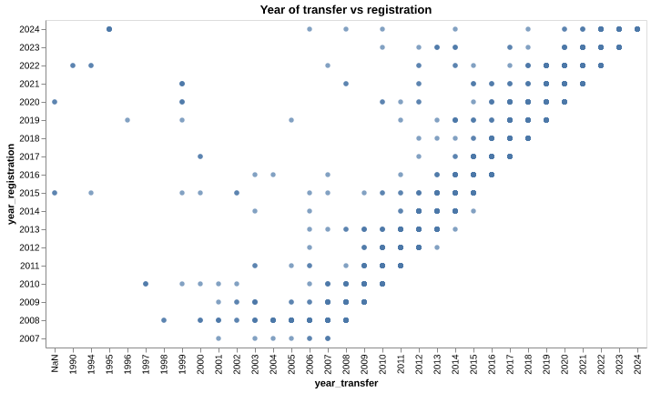

# Register of merged charities

## Observations on data quality

The UK Charity Commission is responsible for registering and regulating charities in England and Wales. The Commission's data provides valuable insights into the charity sector, including information on charity registrations, mergers, and financial activities. However, the quality of this data is crucial for accurate analysis and decision-making.

One of the goals of our analysis is to identify and document data quality and completeness issues: we intend to raise this with the Charity Commission so as to improve the accuracy and reliability of analysis and decision-making in the charity sector.

### Inconsistent date ranges and potential errors in merger and registration dates

The *Register of merged charities* contains **mergers from 1990**, while the **registrations start in late 2007**. Either the register retroactively included a subset of mergers dating from 1990, or the data was entered erroneously.

The **timespans between the dates of transfer and of registration can go from -1y to 32y**, but vary wildly even when outliers are removed. Most mergers are registered a few years after the event, which fits one's understanding of how such processes work: pre-registered mergers or ones registered decades later seem improbable. 

The repetitive seesaw pattern also seems to indicate systematic errors in data processing rather than in data entry, though it's not obvious what it's due to.

These very few ancient transfers and their late registrations are probably errors, so we'll choose to drop any transfers from <2008 in our analysis, as they are few and represent the bulk of the long `registered-transfer` durations.

### Inconsistent charity number formatting

Charity numbers are generally indicated in the data files as a series of digits between parentheses at the end of the charity name: for example, `Crisis UK (1082947)`.

The charity numbers are sometimes not between parentheses, or contain varying separator characters (1170369-1 vs 1053467.01), or the parentheses contain additional information (status or name).

Often, the charity is exempt from having a registration number, and the reason is often indicated, but it is not provided systematically, and the wording varies greatly.

That **the charity numbers or their absence are not indicated in a standardised way** translates to a **need to identify and evaluate the discrepancies case by case**, as this is key information which cannot be discarded. For example, to find which charities are exempt from registration, one first needs to find the many ways that this information is conveyed ("exempt", "excepted", "all exempted", etc.).

### Inconsistent charity name spellings

**3% of charities, as identified by their charity number, present inconsistent spelling of their name**: for example, *Harrogate & Area Council for Voluntary Service Ltd* and *Harrogate and Area Council for voluntary Services Limited*. 

In most cases, this is due to data entry errors, but sometimes it's ambiguous whether the charity changed its name. While individual charities can be identified through the charity number, the inconsistencies in that information as explained above might affect accuracy. 

### Historical data

The data made available by the Charity Commission is their latest snapshot, but most analyses that we could do require some amount of historical data, to evidence trends. Historical information can be extracted from each charity's annual returns, but this approach does not allow for aggregate analysis. 

While the Charity Commission doesn't provide such historical data, we have started our own [archival effort](https://github.com/dataactivists/charity_commission_register/tree/main/archive) for this purpose. This involves:

- [x] collecting and storing the Charity Commission's open data daily
- [ ] storing the data in a standardised format that allows diffing
- providing access to the historical data for researchers and analysts.

### Missing data

[Merging two or more Charitable Incorporated Organisations (CIOs)](https://www.gov.uk/government/publications/register-of-merged-charities/guidance-about-the-register-of-merged-charities#merging-two-or-more-charitable-incorporated-organisations-cios) **does not require the merger to be registered**. Consequently, the register of merged charities will be missing this data: this data might need to be FOIA'd to be accessed.

### Mitigation

The issues already identified here and those yet to identify will be communicated to the Charity Commission, so as to enable them to improve the data quality and facilitate analysis.

To address the issue of inconsistent dates, spellings, and numbers, we recommend that the Charity Commission:

- Conduct a thorough review of the data to identify and correct errors
- Develop and implement data validation rules to prevent errors
- Move the charity number into its own column in the data and validate its format
- Provide clear guidance to users on how to interpret and use the data
