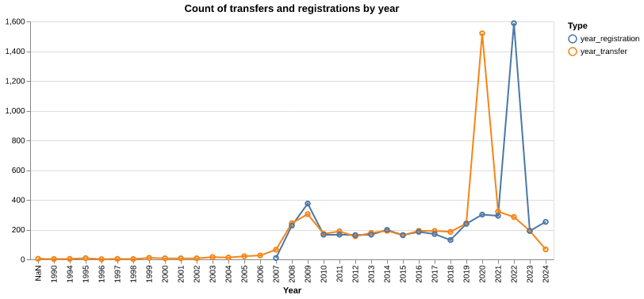

# Register of merged charities

## Observations on data quality

The analysis uncovered some (mostly unintended) issues in data quality and completeness. 

Ideally, this will be raised with the Charity Commission.

### Missing data

[Merging two or more Charitable Incorporated Organisations (CIOs)](https://www.gov.uk/government/publications/register-of-merged-charities/guidance-about-the-register-of-merged-charities#merging-two-or-more-charitable-incorporated-organisations-cios) does not require the merger to be registered. Consequently, the register of merged charities will be missing this data. Does this data need to be FOIA'd?

### Unexpected patterns in dates

The *Register of merged charities* contains mergers from 1990, while the registrations start in late 2007. The timespans between the dates of transfer and of registration can go from -1y to 32y, but vary wildly even when outliers are removed.

It seems unlikely that these very few ancient transfers and their late registrations represent reality. The repetitive seesaw pattern also seems to indicate errors, though it's not obvious what it's due to.

We'll choose to drop any transfers from <2008 in our analysis, as they are few and represent the bulk of the long `registered-transfer` durations.

### No standard way of indicating charity numbers

Charity numbers are indicated as a series of numbers between parentheses at the end of the string.

However, this series of numbers is sometimes not between parentheses, sometimes contains a separator (which varies from one transferor to another). 

Sometimes, the reason for why charity does not have a charity number is indicated, but it is not provided systematically, and the wording varies.

This creates hurdles in analysis, as all these discrepancies need to be identified and navigated case by case.
