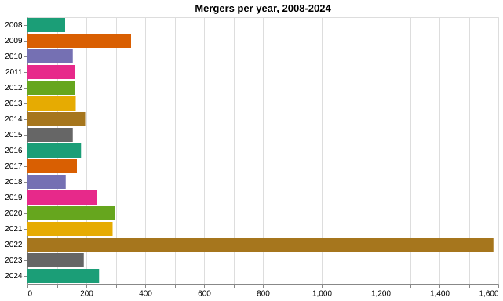

# Register of merged charities

## Merger counts

We're counting mergers per year, as indicated by the date of transfer.

That spike in 2022? It's the merger of 1279 Jehovah's Witnesses churches into The Kingdom Hall Trust.

When we group consolidation mergers (multiple transfers that occurred on the same date to the same transferee), we observe that there was a steady increase in mergers that reached a plateau in 2021 and started decreasing. 

