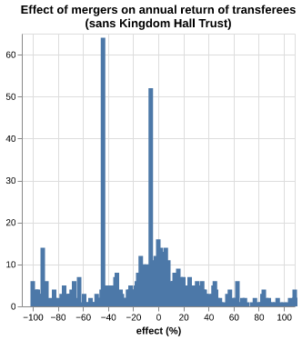

# Register of merged charities

## Effect of mergers on annual return

#### 12% of mergers result in the creation of new charities

As indicated by the number of unregistered organisations or organisations with an annual return of 0 before merger, and >0 after merger.

Most mergers seem to result in the transferee having a 80% decrease of their annual return.

However, this peak at 1200 is reminiscent of a previous chart...

The story is different when we exclude Kingdom Hall Trust from our analysis.

#### The bulk of transferees seem to have had +/- 40% change to their annual returns within the financial period that a merger happened in. 

#### For most transferors, their annual return either went to 0 or remained the same.

This indicates that most transferors either merge into the transferee and cease to exist as an entity, or their merger is largely inconsequential in terms of annual return.
