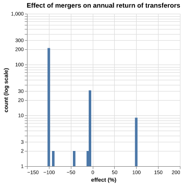

# Register of merged charities

## Effect of mergers on annual return

#### 11% of mergers result in the creation of new charities

As indicated by the number of unregistered organisations or organisations with an annual return of 0 before merger, and >0 after merger.

#### After a merger, most transferee organisations either cease to exist or have a +/- 40% change to their annual return.

According to the data, most mergers (including consolidation mergers) are of the type:

- the transferees do not declare an annual return, indicating either that they cease to exist within the financial period
- the transferees have a +/- 40% change to their annual returns within the financial period that a merger happened in.

The majority of transferees disappearing after a merger is suspicious and might indicate an issue in the analysis or a subsequent merger into a new structure within the financial period.

#### For most transferors, their annual return either went to 0 or remained the same.

This indicates that most transferors either merge into the transferee and cease to exist as an entity (effect -100%), or their merger is largely inconsequential in terms of annual return. However, some transferors declare their first annual return after the merger (effect +100%), which raises questions about the analysis, but a domain expert might be able to explain this.
