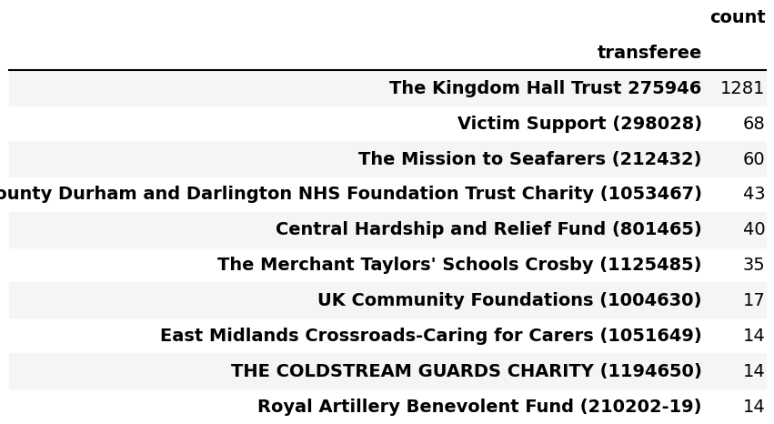
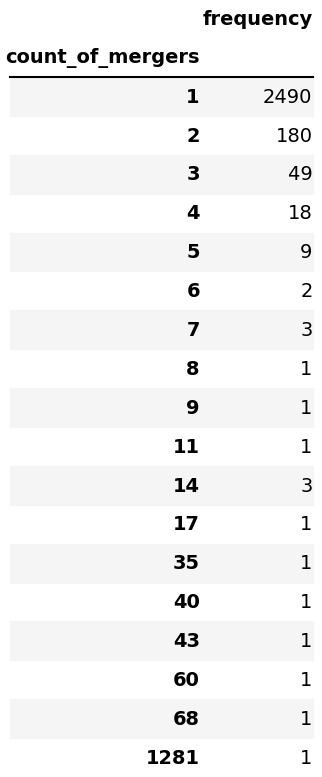
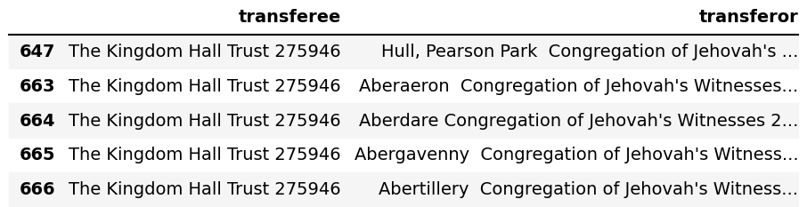
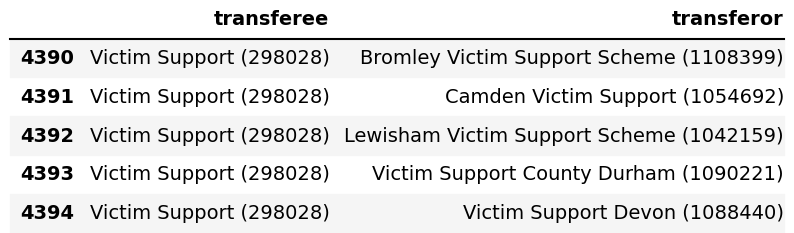

# Register of merged charities

## Most frequent transferees

Without counting the outlier that merged 1200+ times, some transferees have gone through mergers >40 times.

Most transferees only go through a merger <5 times.

Both Kingdom Hall Trust and Victim Support (and other frequent transferees) seem to be consolidation mergers. 

Summary from a [Brave](https://search.brave.com/search?q=The+Kingdom+Hall+Trust+&summary=1) search:

> The Kingdom Hall Trust:
> 
> - Previously known as the London Company of Kingdom Witnesses, it was established on 28th July 1939 and changed its name to The Kingdom Hall Trust on 20th June 1994.
> - It is a charity associated with Jehovah's Witnesses, with the charity number GB-CHC-275946.
> - The charity has undergone a significant merger in 2022, incorporating 1,279 Jehovah's Witness congregations into the national charity. This is considered one of the largest charity mergers ever.
