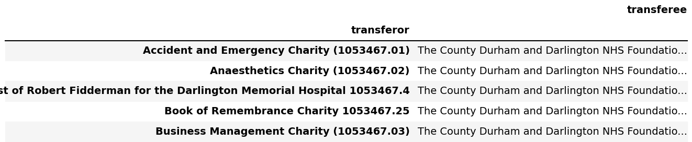
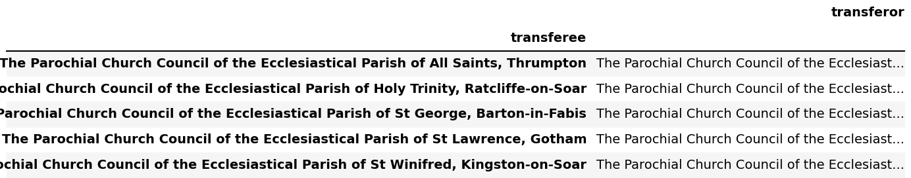

# Register of merged charities

## Most frequent transferors

### Most transferors are unregistered, exempt, or excepted.

The [Guidance about the register of merged charities](https://www.gov.uk/government/publications/register-of-merged-charities/guidance-about-the-register-of-merged-charities#different-types-of-merger) states:

> There are different types of merger:
> 
> - merging with an existing charity
> - merging with a new charity you have set up for the purpose of merging
> - changing structure - usually a trust or unincorporated association that wants to change to a CIO or charitable company.

The prevalence of unregistered/exempt/excepted transferors probably indicates one of two things:

- Mergers of ****very small charities (which are unregistered/exempt) officially joining bigger ones****. It's likely that these small charities are merging with larger ones to gain economies of scale, access to more resources, or to increase their impact. Alternatively, they might be facing hurdles due to funding constraints, regulatory burdens, or other challenges, and merging with a larger charity is a way to ensure their assets and mission continue.
- Mergers of charities into ****a new structure (CIO or charitable company)****.

We'll look at charities 1053467 (75 mergers) and 1189059 (5 mergers) later.

### Most registered transferors have only been in the position of transferring charity once or twice.

This makes sense, since the transferor charity typically ceases to exist as a separate entity after the merger.

The outcomes of a merger, as stated by the [Guidance about the register of merged charities](https://www.gov.uk/government/publications/register-of-merged-charities/guidance-about-the-register-of-merged-charities#why-register):

> - your charity has closed or will close as a result of transferring your assets or
> - your charity has not closed only because it has permanent endowment which will not be transferred to the charity you are merging with

These repeat transferors might be falling into this second case.

### *The County Durham and Darlington NHS Foundation Trust Charity* seems to be a case of a large consolidation.

A number of department-specific NHS charities have merged into one entity. The aim could be to consolidate funds/reduce administrative overhead/streamline operations.

### *The Parochial Church Council of the Ecclesiastical Parish of The A453 Churches of South Nottinghamshire* seems to be an example of a "merged" charity splitting into separate entities.

It is the most frequent transferor among registered charities, having been in that position 5 times.

While this seems to be a reverse merger, it could also be the parent charity distributing some assets to children charities.
